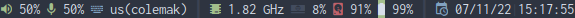

Mstatus is a minimal status bar for DWM that comes preconfigured out of the box including these features:

* colored unicode icons support
* unicode icons change based on the status of the module
* updates every millisecond (can be changed)
* separated by separators

# Dependencies

## Mandatory

#. cpupower (CPU governor and speed)
#. acpi (battery support)

## Optional

#. nerd-fonts-symbols (icon suport) (A patched font is recemmended. I use Inconsolata.)
#. [DWM status2d patch](https://dwm.suckless.org/patches/status2d/) (color support)

# Installation

## Universal

```sh
`# user` git clone https://github.com/amarakon/mstatus
`# user` cd mstatus
`# root` make install
```

## Gentoo

```sh
`# root` eselect repository add amarlay git https://github.com/amarakon/amarlay
`# root` emerge --sync amarlay
`# root` emerge x11-misc/mstatus
```

# Uninstallation

## Universal

```sh
`# user` cd mstatus
`# root` make uninstall
```

## Gentoo

```sh
`# root` emerge -c x11-misc/mstatus
# Remove my overlay (optional)
`# root` eselect-repository remove -f amarlay
`# root` emerge --sync
```
