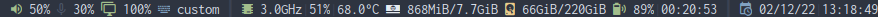

# Mstatus

Mstatus is a minimal status bar for DWM that comes preconfigured out of the box including these features:
* Colored unicode icons support
* Unicode icons change based on the status of the module
* Updates every millisecond (can be changed)
* Separated by separators

## Dependencies
### Mandatory
1. lm-sensors (CPU Temperature)
1. sysstat (CPU Speed)
1. acpi (Battery support)
### Optional
1. [DWM status2d patch](https://dwm.suckless.org/patches/status2d/) (color support)
1. nerd-fonts-symbols (Unicode icon suport) (A patched font is recemmended. I use Inconsolata.)

## (Un)Installation
### Universal
#### Installation
##### Latest Git Master (Bleeding Edge)
1. Git clone the repository.
* `$ git clone https://github.com/Amarakon55/mstatus`
2. Change working directory to mstatus.
* `$ cd mstatus`
3. Install Mstatus using the Makefile
* `# make install`
#### Uninstallation
##### Latest Git Master (Bleeding Edge)
1. Change working directory to mstatus.
* `$ cd mstatus`
2. Uninstall Mstatus using the Makefile
* `# make uninstall`
